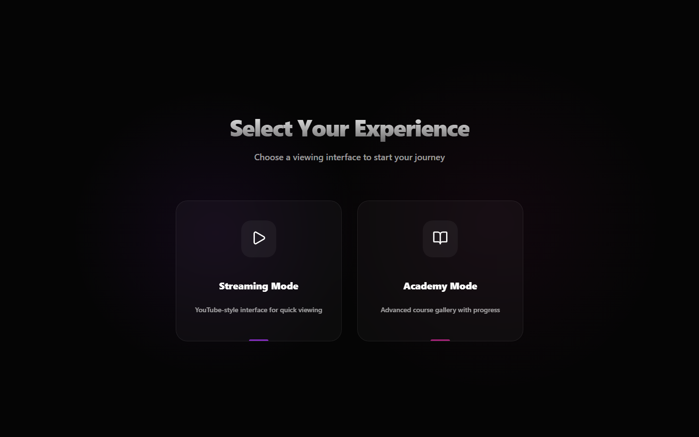
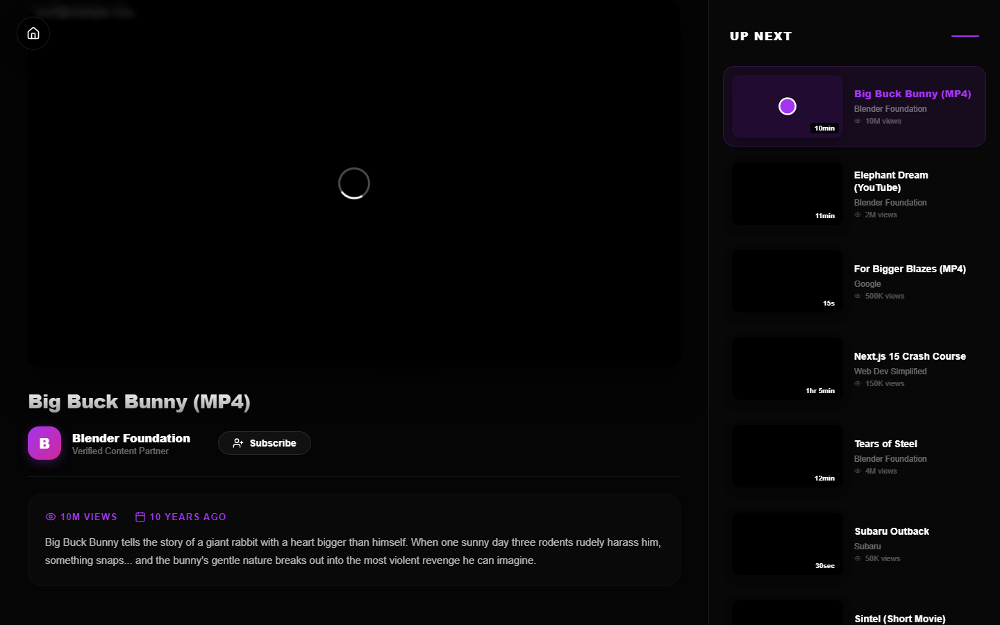
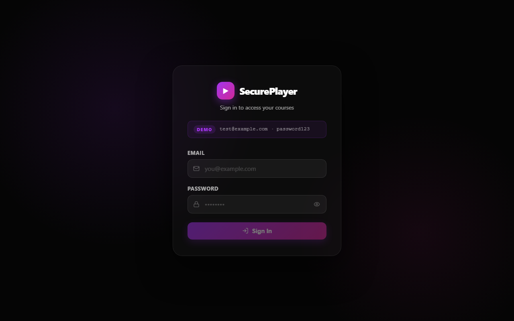
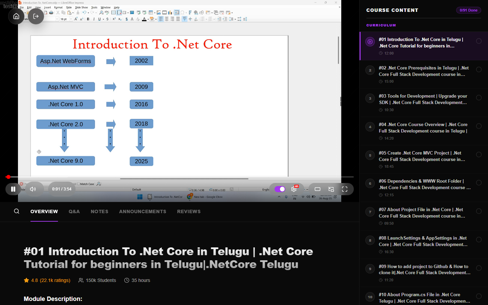

<div align="center">

# 🎬 Secure Universal Video Player

**A professional, cinematic video platform with enterprise-grade content protection.**

Built with React 19 · TypeScript · Vite 7 · Framer Motion

[](https://react.dev)
[](https://www.typescriptlang.org)
[](https://vitejs.dev)
[](LICENSE)

</div>

---

## 📸 Screenshots

<table>
<tr>
<td width="50%">

### 🔐 Login Screen
*Auth guard with demo credentials hint*


</td>
<td width="50%">

### 🏠 Home Screen
*Choose your viewing experience*



</td>
</tr>
<tr>
<td width="50%">

### 📺 Streaming Mode
*YouTube-style interface with playlist sidebar*



</td>
<td width="50%">

### 🎓 Academy — Course Gallery
*Browse courses with neon progress tracking*



</td>
</tr>
<tr>
<td width="50%">

### 📖 Course Player
*Redesigned sidebar — full titles, progress bar, 2-line wrap*



</td>
<td width="50%"></td>
</tr>
</table>

---

## ✨ Feature Overview

### 🎯 Dual Viewing Modes

| Mode | Description |
|------|-------------|
| **Streaming Mode** | YouTube-style layout — playlist sidebar, video metadata, channel info, auto-play next |
| **Academy Mode** | Udemy-style course gallery with progress tracking, thumbnails, and category badges |

---

### 🔒 Security & Content Protection

| Feature | Details |
|---------|---------|
| **Moving Watermark** | Floating user email shifts position on a timer to deter screen recording |
| **Tiled Watermark** | Semi-transparent full-canvas overlay for constant user identification |
| **IFrame Shield** | Invisible layer over the video iframe blocks direct manipulation |
| **DevTools Detection** | Polls window size delta every 1.5s; prompts user to close DevTools when open |
| **Right-Click Block** | Context menu disabled globally across the player |
| **Keyboard Lock** | Blocks F12 to prevent quick DevTools access |
| **`disablePictureInPicture`** | Native browser PiP disabled on HTML5 elements; custom PiP used instead |

---

### 🎮 Player Controls

#### Playback Features
- ▶️ **Play / Pause** with animated loading spinner
- ⏩ **Seek** — click or drag the timeline scrubber
- 🔊 **Volume** — hover-expand slider with mute toggle
- 📶 **Buffered Bar** — visual buffer indicator on the timeline
- 🕐 **Timeline Hover Preview** — timestamp tooltip on hover
- ⚡ **Playback Speed** — 0.5×, 0.75×, 1×, 1.25×, 1.5×, 2×
- 🎛️ **Quality Selector** — 4K · 1440p · 1080p · 720p · 480p · 360p · 240p · 144p · Auto
- ⏭️ **Auto-play Next** — toggle with 5-second countdown overlay (cancel/confirm)
- 🪟 **Picture-in-Picture** — custom PiP with draggable resize handle (320–800px)
- 🖥️ **Theater Mode** — cinematic widescreen expansion
- ⛶ **Fullscreen** — native fullscreen with controls auto-show on enter/exit
- 👁️ **Controls Auto-hide** — fade out after 3s of inactivity, restore on mouse move

#### Progress & Milestones
- 📊 **Milestone Tracking** — fires events at 25%, 50%, 75%, and 100% watch progress
- ✅ **Lesson Completion** — auto-marks lesson complete when video ends
- 💾 **`localStorage` Persistence** — completion state survives page refreshes

---

### ⌨️ Keyboard Shortcuts

| Key | Action |
|-----|--------|
| `Space` / `K` | Play / Pause |
| `M` | Toggle Mute |
| `F` | Toggle Fullscreen |
| `T` | Toggle Theater Mode |
| `P` | Toggle Picture-in-Picture |
| `←` / `→` | Seek backward / forward 5 seconds |
| `↑` / `↓` | Volume up / down 10% |

---

### 🎓 Academy Mode — Course Player

- 📑 **Tab Bar** — Overview · Q&A · Notes · Announcements · Reviews
- 📚 **Course Content Sidebar** — lesson list with completion checkboxes
- 🎭 **Theater Mode Sidebar** — sidebar floats alongside the expanded player
- ⭐ **Course Stats** — rating, student count, total duration
- 🔝 **Scroll-to-Top** button (appears after scrolling)
- 📱 **Mobile Tap Support** — `PointerUp` events for reliable touch interaction

---

## 🏗️ Architecture

```
src/
├── components/
│   ├── SecureVideoPlayer/          # Core secure player system
│   │   ├── SecureVideoPlayer.tsx   # Root — detects YouTube vs HTML5
│   │   ├── components/
│   │   │   ├── PlayerControls.tsx  # Full control bar (timeline, volume, etc.)
│   │   │   ├── MovingWatermark.tsx # Animated position-shifting watermark
│   │   │   ├── TiledWatermark.tsx  # Full-canvas tiled overlay
│   │   │   ├── IframeShield.tsx    # Invisible iframe interaction blocker
│   │   │   ├── PlayerLoadingOverlay.tsx
│   │   │   └── PlayerCountdownOverlay.tsx  # Auto-next countdown
│   │   ├── hooks/
│   │   │   ├── useYouTubePlayer.ts     # YouTube IFrame API integration
│   │   │   ├── useHtml5Player.ts       # HTML5 <video> integration
│   │   │   ├── useSecurity.ts          # Right-click + F12 blocking
│   │   │   ├── useDevToolsDetection.ts # DevTools open detection
│   │   │   ├── useControlsVisibility.ts # Auto-hide controls
│   │   │   ├── usePlayerMilestones.ts  # 25/50/75/100% events
│   │   │   ├── usePlayerCountdown.ts   # Auto-next countdown timer
│   │   │   ├── usePiPResize.ts         # Draggable PiP resize
│   │   │   ├── useWatermarkPosition.ts # Watermark movement logic
│   │   │   └── useYouTubeAPI.ts        # YT API script loader
│   │   └── types/
│   │       └── player.types.ts         # VideoPlayerAPI interface
│   ├── HomeView.tsx          # Mode selection landing screen
│   ├── PlaylistPage.tsx      # Streaming mode layout
│   ├── PlaylistSidebar.tsx   # Video list sidebar
│   ├── CourseListPage.tsx    # Academy course gallery
│   ├── CoursePlayerPage.tsx  # Course player with tabs & sidebar
│   ├── CourseContentSidebar.tsx
│   ├── PlayerControls.tsx    # (legacy/shared)
│   └── DevToolsGuard.tsx     # App-level DevTools guard overlay
├── data/
│   ├── mockData.ts           # Playlist & course interfaces + data
│   ├── dotnet_core_course.json
│   ├── sql_realtime_course.json
│   └── angular_course.json
├── hooks/
│   └── useScrollToTop.ts     # Generic scroll-to-top hook
├── styles/                   # Page-level CSS modules
└── utils/
    └── authService.ts        # Auth helpers
```

---

## 🛠️ Tech Stack

| Package | Version | Purpose |
|---------|---------|---------|
| `react` | 19 | UI framework |
| `typescript` | 5.9 | Type safety |
| `vite` | 7 | Dev server & bundler |
| `framer-motion` | 12 | Animations & transitions |
| `lucide-react` | 0.562 | Icon system |
| `sonner` | 2 | Toast notifications |

---

## 🚀 Getting Started

### Prerequisites

- Node.js v18+
- npm v9+

### Installation

```bash
# 1. Clone the repository
git clone <your-repo-url>
cd unlistedvideoplayer

# 2. Install dependencies
npm install

# 3. Start the dev server
npm run dev
```

Open [http://localhost:5173](http://localhost:5173) in your browser.

### Available Scripts

```bash
npm run dev       # Start dev server (with hot reload)
npm run build     # Production build (TypeScript check + Vite bundle)
npm run preview   # Preview production build locally
npm run lint      # ESLint check
npm test          # Run Jest test suite
```

---

## 🎥 Supported Video Sources

| Source | Format | Example |
|--------|--------|---------|
| YouTube ID | 11-char string | `dQw4w9WgXcQ` |
| YouTube URL | Full / short URL | `https://youtu.be/dQw4w9WgXcQ` |
| YouTube Embed | Embed URL | `https://youtube.com/embed/...` |
| HTML5 / MP4 | Direct file URL | `https://example.com/video.mp4` |
| Local MP4 | Public folder path | `/course_videos/lesson1.mp4` |

---

## 🔑 Demo Credentials

The app includes a mock `AuthService` for local development. Use these credentials to log in:

| Field | Value |
|-------|-------|
| **Email** | `test@example.com` |
| **Password** | `password123` |

> The watermark on the player will display the logged-in user's email. If no user is authenticated, it falls back to `guest@example.com`.

---

## ♻️ Reusing the Player in Another React Project

The `SecureVideoPlayer` is fully self-contained and designed to drop into **any React + TypeScript project** with zero modifications. Everything it needs lives inside one folder.

---

### Step 1 — Copy the folder

Copy the entire `SecureVideoPlayer/` directory into your project:

```
your-project/
└── src/
    └── components/
        └── SecureVideoPlayer/       ← copy this whole folder
            ├── index.ts             (public API — import only from here)
            ├── SecureVideoPlayer.tsx
            ├── config/
            │   └── playerConfig.ts
            ├── components/
            │   ├── PlayerControls.tsx
            │   ├── ControlTooltip.tsx
            │   ├── TimelineBar.tsx
            │   ├── VolumeControl.tsx
            │   ├── SettingsMenu.tsx
            │   ├── MovingWatermark.tsx
            │   ├── TiledWatermark.tsx
            │   ├── IframeShield.tsx
            │   ├── PlayerLoadingOverlay.tsx
            │   └── PlayerCountdownOverlay.tsx
            ├── hooks/
            │   ├── useYouTubePlayer.ts
            │   ├── useHtml5Player.ts
            │   ├── useFullscreen.ts
            │   ├── useKeyboardShortcuts.ts
            │   ├── usePlayerPersistence.ts
            │   ├── usePlayerMilestones.ts
            │   ├── usePlayerCountdown.ts
            │   ├── useControlsVisibility.ts
            │   ├── usePiPResize.ts
            │   ├── useWatermarkPosition.ts
            │   ├── useSecurity.ts
            │   ├── useDevToolsDetection.ts
            │   └── useYouTubeAPI.ts
            ├── styles/
            │   ├── SecureVideoPlayer.css
            │   ├── PlayerControls.css
            │   ├── PlayerOverlays.css
            │   ├── MovingWatermark.css
            │   ├── TiledWatermark.css
            │   └── IframeShield.css
            ├── types/
            │   ├── player.types.ts
            │   └── youtube-api.d.ts
            └── utils/
                ├── playerStorage.ts
                └── useYouTubeAPI.ts
```

---

### Step 2 — Install peer dependencies

The player needs these packages in the target project:

```bash
npm install lucide-react
```

> **Note:** `react` and `react-dom` (v18+) must already be installed.  
> `framer-motion` and `sonner` are **not** required by the player itself — only by the surrounding app UI.

Verify your `tsconfig.json` includes `"lib": ["DOM", "DOM.Iterable", "ESNext"]` — needed for the YouTube IFrame API types.

---

### Step 3 — Basic usage

```tsx
import { SecureVideoPlayer } from "./components/SecureVideoPlayer";

function MyPage() {
  return (
    <SecureVideoPlayer
      src="dQw4w9WgXcQ"        {/* YouTube ID, YouTube URL, or MP4 URL */}
      userEmail="user@acme.com" {/* shown in the watermark overlay */}
    />
  );
}
```

That's all the required props. Everything else is optional.

---

### Step 4 — Supported `src` formats

| Format | Example |
|--------|---------|
| YouTube video ID | `dQw4w9WgXcQ` |
| YouTube full URL | `https://www.youtube.com/watch?v=dQw4w9WgXcQ` |
| YouTube short URL | `https://youtu.be/dQw4w9WgXcQ` |
| YouTube embed URL | `https://youtube.com/embed/dQw4w9WgXcQ` |
| Remote MP4 | `https://cdn.example.com/video.mp4` |
| Local MP4 | `/videos/lesson1.mp4` |

---

### Step 5 — Full props reference

```tsx
<SecureVideoPlayer
  {/* ── Required ───────────────────────────────────────────── */}
  src="dQw4w9WgXcQ"
  userEmail="user@acme.com"

  {/* ── Layout ─────────────────────────────────────────────── */}
  isTheaterMode={false}            // controlled theater mode
  onToggleTheater={() => {}}       // callback when theater button clicked
  fullWidth={false}                // fill container width (no max-width)

  {/* ── Playback ────────────────────────────────────────────── */}
  autoPlay={true}                  // start playing immediately
  onEnded={() => loadNextVideo()}  // fires when video finishes

  {/* ── Auto-play next ──────────────────────────────────────── */}
  autoPlayNext={true}
  onToggleAutoPlayNext={() => setAutoPlay(v => !v)}

  {/* ── Behaviour overrides (all optional) ─────────────────── */}
  config={{
    seekStepS: 10,                 // arrow-key seek jump (default: 5s)
    volumeStep: 5,                 // arrow-key volume step (default: 10)
    controlsHideMs: 2000,          // controls fade timeout (default: 3000ms)
    positionSaveMs: 5000,          // resume-position save interval (default: 2000ms)
    watermarkMoveMs: 15000,        // watermark shift interval (default: 20000ms)
    playbackRates: [1, 1.5, 2],    // speeds shown in Settings menu
    persistSettings: true,         // save volume/speed to storage (default: true)
    keyboardShortcuts: {
      playPause:    ["Space", "KeyK"],
      mute:         ["KeyM"],
      fullscreen:   ["KeyF"],
      theater:      ["KeyT"],
      pip:          ["KeyP"],
      seekBackward: ["ArrowLeft"],
      seekForward:  ["ArrowRight"],
      volumeUp:     ["ArrowUp"],
      volumeDown:   ["ArrowDown"],
    },
  }}
/>
```

---

### Step 6 — Using a custom storage backend

By default settings (volume, speed, resume position) are saved to `localStorage`.  
To change this — swap the storage adapter:

```tsx
// sessionStorage — clears on tab close
import { WebStorageAdapter } from "./components/SecureVideoPlayer";
const storage = new WebStorageAdapter(sessionStorage);

// In-memory — nothing persisted (useful for tests)
import { MemoryStorageAdapter } from "./components/SecureVideoPlayer";
const storage = new MemoryStorageAdapter();

// No persistence at all
import { NoopStorageAdapter } from "./components/SecureVideoPlayer";
const storage = new NoopStorageAdapter();
```

Then pass it directly to the low-level hooks if you need full control:

```tsx
import { useYouTubePlayer, MemoryStorageAdapter } from "./components/SecureVideoPlayer";

const storage = new MemoryStorageAdapter();

const playerAPI = useYouTubePlayer({
  videoId: "dQw4w9WgXcQ",
  storage,          // injected — no localStorage used
});
```

---

### Step 7 — Remap or disable keyboard shortcuts

```tsx
// Disable PiP shortcut, remap theater to Alt+T
<SecureVideoPlayer
  src="..."
  userEmail="user@acme.com"
  config={{
    keyboardShortcuts: {
      pip:    [],               // empty array = disabled
      theater: ["AltLeft+KeyT"], // custom combo (not natively supported — use [] to just disable)
    },
  }}
/>
```

---

### Step 8 — Listen to progress milestones

The player fires milestone callbacks at 25 / 50 / 75 / 100% watch progress.  
Use the hook directly if you need analytics:

```tsx
import { usePlayerMilestones } from "./components/SecureVideoPlayer";

usePlayerMilestones({
  currentTime: player.currentTime,
  duration:    player.duration,
  milestones:  [25, 50, 75, 100],
  onMilestoneReached: (pct) => {
    analytics.track("video_milestone", { percent: pct });
  },
});
```

---

### Step 9 — Build your own player UI

All hooks are exported individually. You can skip `SecureVideoPlayer` entirely and compose your own UI:

```tsx
import {
  useYouTubePlayer,
  useKeyboardShortcuts,
  usePlayerMilestones,
  useControlsVisibility,
} from "./components/SecureVideoPlayer";

function MyCustomPlayer({ videoId }: { videoId: string }) {
  const player = useYouTubePlayer({ videoId, autoplay: true });

  useKeyboardShortcuts({
    actions: {
      onPlayPause:    player.togglePlay,
      onMute:         player.toggleMute,
      onFullscreen:   player.toggleFullscreen,
      onTheater:      () => {},
      onPiP:          player.togglePiP,
      onSeekBackward: () => player.seek(player.currentTime - 10),
      onSeekForward:  () => player.seek(player.currentTime + 10),
      onVolumeUp:     () => player.setVolume(Math.min(100, player.volume + 5)),
      onVolumeDown:   () => player.setVolume(Math.max(0,   player.volume - 5)),
    },
  });

  return (
    <div ref={player.ref}>
      <div ref={player.videoRef as React.RefObject<HTMLDivElement>} />
      <button onClick={player.togglePlay}>
        {player.playing ? "Pause" : "Play"}
      </button>
    </div>
  );
}
```

---

### Checklist before shipping

```
✅  SecureVideoPlayer/ folder copied into your project
✅  lucide-react installed  (npm install lucide-react)
✅  tsconfig.json has "lib": ["DOM", "DOM.Iterable", "ESNext"]
✅  userEmail prop set to the logged-in user's real email
✅  Import only from index.ts  (never from internal sub-files)
✅  config prop set if you need custom shortcuts / storage / speeds
✅  Tested on mobile  (touch tap support is built-in via PointerUp)
```

---

### Troubleshooting

| Problem | Fix |
|---------|-----|
| YouTube video shows a black box | Check your domain is not blocked by YouTube's embed policy. Add `widget_referrer` via the hook props. |
| `YT is not defined` error | The YouTube IFrame API loads asynchronously. The player handles this via `loadYouTubeAPI()` — ensure only **one** instance of the player mounts at a time during init. |
| Watermark text shows `undefined` | `userEmail` prop is required and must be a non-empty string. |
| Settings not persisting | Check `config.persistSettings` is not set to `false`, and that `localStorage` is available in your environment. |
| Controls never hide | Make sure `autoPlay` is `true` or the user has started playback — controls only auto-hide while playing. |
| TypeScript errors after copy | Ensure `lucide-react` and `@types/youtube` are installed: `npm install lucide-react @types/youtube` |

---

## ⚠️ Known Limitations

| Limitation | Details |
|------------|---------|
| **Browser-level security only** | Watermarks, DevTools blocking, and right-click prevention are UI-layer protections. They deter casual copying but cannot prevent a determined user with network-level access. |
| **No URL-based routing** | Navigation is state-driven — deep-linking to a specific course or video is not supported. Refreshing the page always returns to the home screen. |
| **Mock auth only** | `AuthService` is a local mock with no real backend. All credentials are hardcoded. |
| **Hardcoded course stats** | Ratings, student counts, and review data are static mock values, not fetched from an API. |
| **No offline support** | There is no service worker or caching strategy for offline playback. |

---

## 📄 License

This project is proprietary and private. All rights reserved.

---

<div align="center">

Built with ❤️ for secure, high-quality video content delivery.

</div>
